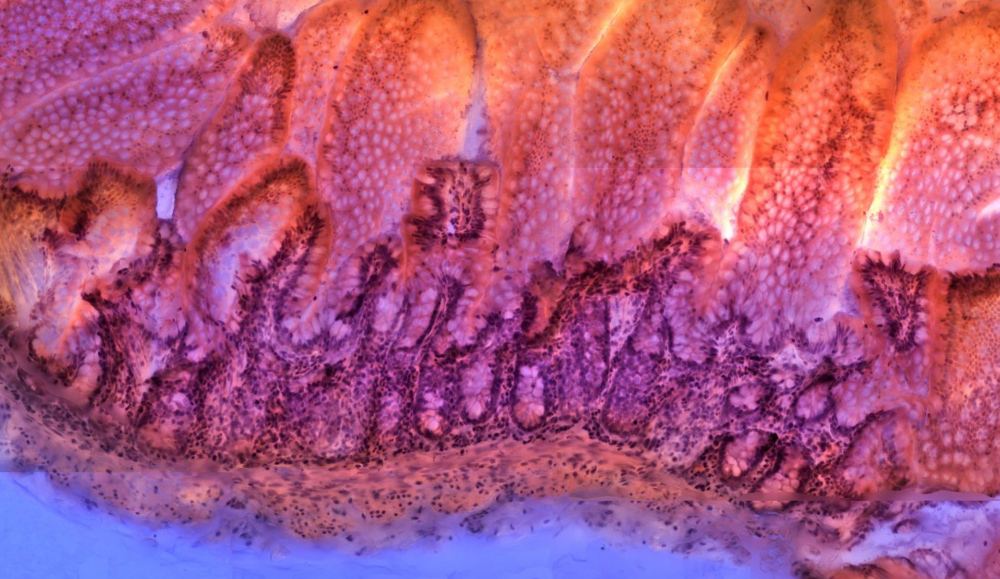
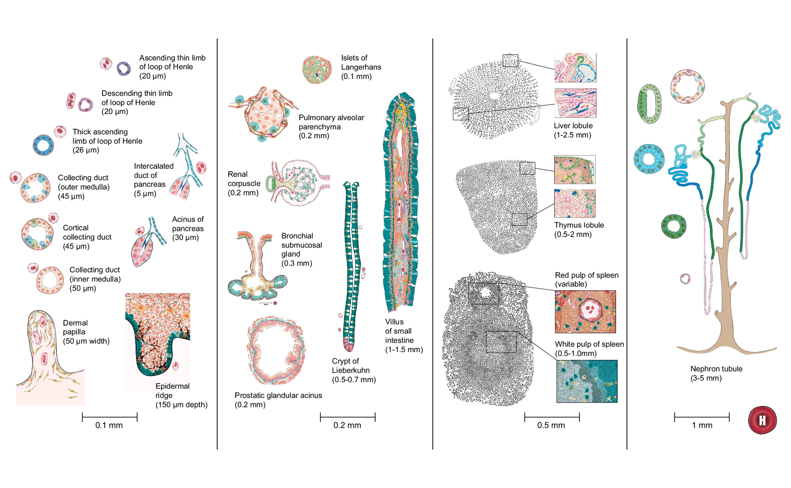
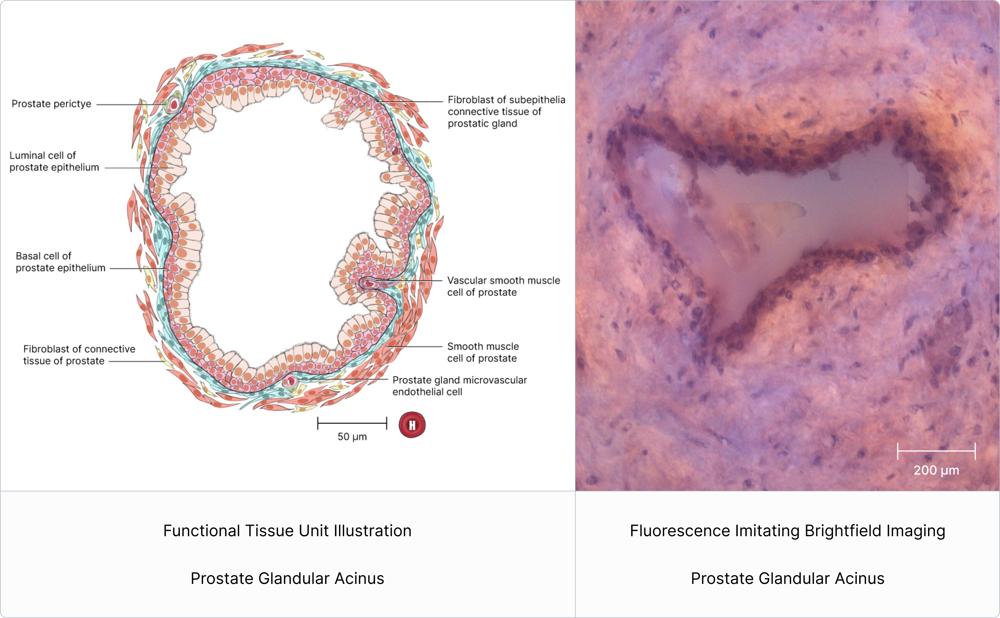

# Fluorescence Imitating Brightfield Imaging (FIBI) For Functional Tissue Units

## June 15, 2025

Fluorescence Imitating Brightfield Imaging (FIBI) \[1\] is a microscopy technique developed at UC Davis by Dr. Farzad Fereidouni with guidance from Dr. Richard Levenson. This technology represents a form of “slide-free microscopy," enabling much faster imaging of tissue specimens at the histological level compared to traditional slide methods, which necessitate extensive processing (such as formalin fixation, paraffin embedding, and thin sectioning). Thick or unsectioned specimens, whether fresh or fixed, can be prepared and scanned in just minutes.  Resulting images reveal the three-dimensional structure of meso-scale anatomical structures (see **Fig. 1**), using a method involving image acquisitions at multiple focal planes..  

 
**Figure 1:** FIBI image of Intestinal Villus. Tissue sample ID B015-C2, provided by Mike Snyder, Stanford University. Scale bar: 1 mm.

# Functional Tissue Units

Functional tissue units (see **Fig. 2**) form the basic building blocks of organs and are important for understanding and modeling the healthy physiological function of the organ and changes that occur during disease states \[2\].  
 
**Figure 2:** A catalog of 22 functional tissue units (FTUs) in the Human Reference Atlas. Image adopted from \[2\].  

# FIBI for Functional Tissue Units

FIBI-processed images (see **Fig. 3, right**) make it possible to study whole FTUs by providing rapid, high-resolution visualization of intact tissue architecture without the need for traditional sectioning. The 2.5-dimensional nature of these images preserves spatial continuity and depth cues, enabling a clearer interpretation of FTU structure and physiological function plus meso-scale tissue organization.

 
**Figure 3**: Visual comparison between the prostate glandular acinus gland FTU (left) and FIBI-processed tissue image of the prostate gland (right).

# Images

All specimens (except prostate and liver) were imaged using the FIBI microscopy method detailed in \[1\]. Although FIBI was designed for fresh/wet tissue imaging, specimens were sent to the imaging lab as FFPE blocks due to the logistical challenges associated with shipping wet tissues. Upon arrival, paraffin was eliminated from the blocks using xylenes, various grades of ethanol, and water. Rehydrated tissues were stained briefly with hematoxylin (15 seconds) and eosin (30 seconds) before being scanned with FIBI. An extended depth of focus (EDOF) system was used during the scanning process to facilitate in-focus capture of irregular surfaces spanning multiple focal planes. For multi-field scans, individual fields of view were flatfield-corrected and stitched together using a stitching algorithm developed by Microvisioneer.

The prostate FTU (glandular acinus) was captured over a series of focal planes to generate an image stack that can be navigated by the viewer for a more interactive experience. Tissue preparation methods were the same as described above.

The liver FTU (liver lobule) was captured from a specimen that was never embedded in paraffin, though staining and imaging were otherwise equivalent to the remaining specimens.

Following acquisition, all images were visually enhanced in GIMP as needed, including processes such as artifact removal, color correction, enhancement of brightness/contrast, and sharpening.

Collection of FIBI images for 13 FTUs across 9 organs:

* [Large Intestine: Multiple Crypt of Liberkuhn of Large Intestine.jpg](https://cdn.humanatlas.io/fibi-image-store/Large%20Intestine/extras/LargeIntestine_Crypt_2_9x16crop_CC_UMNR_NoAlpha.jpg)
* [Large Intestine: Single Crypt of Liberkuhn of Large Intestine.jpg](https://cdn.humanatlas.io/fibi-image-store/Large%20Intestine/LargeIntestine_Crypt_1_9x16crop_CC_UMNR_NoAlpha.jpg)
* [Lung: Alveolus of Lung.jpg](https://cdn.humanatlas.io/fibi-image-store/Lung/Lung_Alveolus_16x9crop_CC_UMNR_NoAlpha.jpg)
* [Pancreas: Islet of Langerhans.jpg](https://cdn.humanatlas.io/fibi-image-store/Pancreas/Pancreas_Islets_1_16x9crop_CC_UMNR_NoAlpha.jpg)
* [Pancreas: Intercalated_Duct And Pancreatic Acinus.jpg](https://cdn.humanatlas.io/fibi-image-store/Pancreas/Pancreas_DuctAndAcinus_1_16x9crop_CC_UMNR_NoAlpha.jpg)
* [Prostate: Prostate_Glandular Acinus.gif](https://cdn.humanatlas.io/fibi-image-store/Prostate/Prostate_Acinus_SquareStack_UM_NoAlpha.gif)
* [Liver: Liver_Lobule.jpg](https://cdn.humanatlas.io/fibi-image-store/Liver/Liver_Lobule_1_16x9crop_CC_UMNR_NoAlpha.jpg)
* [Thymus: Thymus_Lobule.jpg](https://cdn.humanatlas.io/fibi-image-store/Thymus/Thymus_Lobule_9x16crop_CC_UMNR_NoAlpha.jpg)
* [Skin: Epidermal Ridge_And Dermal Papilla.jpg](https://cdn.humanatlas.io/fibi-image-store/Skin/Skin_EpidermalRidge_DermalPapilla_1_16x9crop_CC_UMNR_NoAlpha.jpg)
* [Spleen: Red Pulp And White Pulp.jpg](https://cdn.humanatlas.io/fibi-image-store/Spleen/Spleen_RedAndWhitePulp_9x16crop_CC_UMNR_NoAlpha.jpg)
* [Small Intestine: Intestinal Villus.jpg](https://cdn.humanatlas.io/fibi-image-store/Small%20Intestine/SmallIntestine_Villus_1_9x16crop_CC_UMNR_NoAlpha.jpg)
* [Kidney: Renal Corpuscle.jpg](https://cdn.humanatlas.io/fibi-image-store/Kidney/Kidney_Glom_1_16x9crop_CC_UMNR_NoAlpha.jpg)

# Acknowledgments

This work is the result of a collaborative effort with the Human BioMolecular Atlas Program (HuBMAP) and the University of California, Davis. We thank Nate Anderson (UC Davis) for performing FIBI microscopy from various locations, and Supriya Bidanta (HuBMAP) for engaging with subject matter experts to refine the process for identifying cataloged Functional Tissue Units (FTUs) in the Human Reference Atlas (HRA). We are also grateful to teams that shared organ specific tissue and expertise: Sanjay Jain for kidney, Gloria Pryhuber for lung, Mike Snyder and Chenchen Zhu for large and small intestines, Presha Rajbhandari for liver, Martha Campbell-Thompson for pancreas, Douglas Strand for prostate gland, Fiona Ginty and Arivarasan Karunamurthy for skin, and Clive H. Wasserfall for thymus and spleen. This research has been supported by the NIH Common Fund through the Office of Strategic Coordination/Office of the NIH Director under awards: OT2OD033756 (K.B., Y.Z., G.M.W., Y.J., D.Q., A.B. and B.W.H.) and OT2OD026671 (K.B., G.M.W., Y.J., D.Q., A.B. and B.W.H.); U54 HL165443 and HLU01148861 (G.P., R.M. and J.P.); 1R03OD036499 (Y.Z.); 3U54AG075936 (J.W.H.); OT2OD026675 and OT2OD033759 (P.B., J.C.S. and A.B.); and 3OT2OD033760 (R.S., G.M. and J.F.); as well as 3OT2OD026682 and 1OT2OD033761 (M.R., S.A.T. and C.X.). Further, this work was supported by: the SenNet CODCC under award number U24CA268108 (K.B., J.C.S., Y.J., D.Q., A.B. and B.W.H.); by the NIDDK under award U24DK135157 (K.B., D.Q. and B.W.H.); by the KPMP grant U2CDK114886 (K.B., Y.J., D.Q., A.B. and B.W.H.); by the National Human Genome Research Institute RM1HG011014 (R.S.); and the NIH National Institute of Allergy and Infectious Diseases, Department of Health and Human Services under BCBB Support Services Contract HHSN316201300006W/HHSN27200002. This research was supported in part by the Intramural Research Program of the US NIH. The funders had no role in study design, data collection and analysis, decision to publish or preparation of the manuscript.

# Author information

**Department of Intelligent Systems Engineering, Luddy School of Informatics, Computing, and Engineering, Indiana University, Bloomington, IN, USA**  
Katy Börner, Bruce W. Herr II, Libby Maier & Supriya Bidanta

**University of California, Davis, California, USA**  
Richard M Levenson & Nate Anderson

**University of Rochester Medical Center, Rochester, NY, USA**  
Gloria J. Pryhuber

**Washington University in St. Louis, St. Louis, MO, USA**  
Sanjay Jain & Yiing Lin

**Columbia University, New York, NY, USA**  
Presha Rajbhandari

**University of Texas Southwestern Medical Center, Dallas, TX, USA**  
Douglas W. Strand

**University of Florida, Gainesville, FL, USA**  
Martha Campbell-Thompson & Clive H. Wasserfall

**GE HealthCare Technology & Innovation Center, Niskayuna, NY, USA**  
Fiona Ginty

**University of Pittsburgh, Pittsburgh, PA, USA**  
Arivarasan Karunamurthy

# References

1. Au Yeung, S., P. Giaretta, T. Morningstar, et al. “Utility of Fluorescence Imitating Brightfield Imaging Microscopy for the Diagnosis of Feline Chronic Enteropathy.” *Veterinary Patholog*y 60, no. 1 (2022): 52–59. [https://doi.org/10.1177/03009858221131363](https://doi.org/10.1177/03009858221131363).  
2. Bidanta, S., K. Börner, B. W. Herr II, et al. “Functional Tissue Units in the Human Reference Atlas.” *Nature Communications* 16 (2025): 1526\. [https://doi.org/10.1038/s41467-024-54591-6](https://doi.org/10.1038/s41467-024-54591-6)
