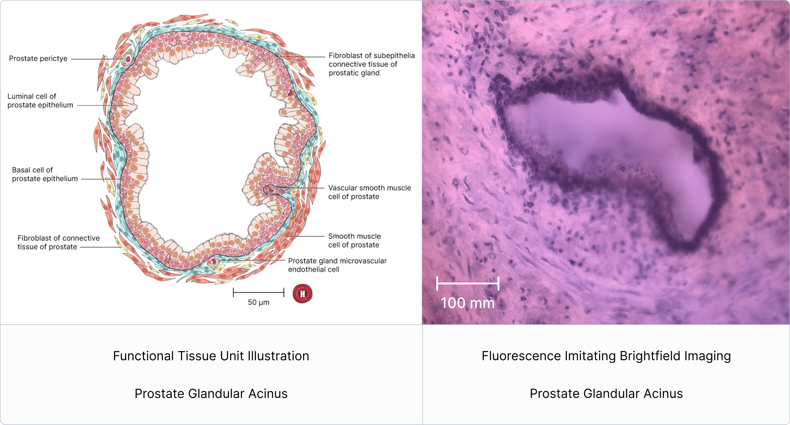

# Fluorescence Imitating Brightfield Imaging (FIBI) For Functional Tissue Units

## June 15, 2025

Figure 1: Intestinal Villus.

# Fluorescence Imitating Brightfield Imaging (FIBI)

Fluorescence Imitating Brightfield Imaging (FIBI) is a microscopy technique developed at UC Davis by Dr. Farzad Fereidouni with guidance from Dr. Richard Levenson. This technology represents a form of “slide-free microscopy," enabling much faster imaging of tissue specimens at the histological level compared to traditional slide methods, which necessitate extensive processing (such as formalin fixation, paraffin embedding, and thin sectioning). Thick or unsectioned specimens, whether fresh or fixed, can be prepared and scanned in just minutes. While the speed of this methodology is a significant benefit, we also believe that the resulting images can offer more detailed information than those from conventional slides, owing to enhanced spatial continuity and a broader spectrum of captured colors.

# Functional Tissue Units

Functional tissue units form the basic building blocks of organs and are important for understanding and modeling the healthy physiological function of the organ and changes that occur during disease states.

Figure 2: A catalog of 22 functional tissue units (FTUs) in the Human Reference Atlas.   
Image credit: Figure 1 from Functional Tissue Units in the Human Reference Atlas.   
DOI: 10.1038/s41467-024-54591-6

# FIBI for Functional Tissue Units

FIBI-processed images offer a powerful advantage in studying functional tissue units (FTUs) by providing rapid, high-resolution visualization of intact tissue architecture without the need for traditional sectioning. The 2.5D nature of these images preserves spatial continuity and depth cues, enabling clearer interpretation of FTU structure and organization. This enhanced dimensionality supports ongoing efforts to gain deeper insights into the physiological function and structural organization of tissues.

Figure 3: A visual comparison between the illustrated prostate gland FTU and FIBI processed tissue image of the prostate gland.

# Images

Collection of FIBI images for 12 FTUs across 9 organs.

* [Large Intestine/Crypt-of-Lieberkuhn-of-Large-Intestine.ome.tif](https://avivator.gehlenborglab.org/?image_url=https://cdn.humanatlas.io/fibi-image-store/Large+Intestine/4_colon_FIBI_HVS109_NoAlpha.ome.tif)  
* [Liver/Liver-Lobule.ome.tif](https://avivator.gehlenborglab.org/?image_url=https://cdn.humanatlas.io/fibi-image-store/Liver/150um+scan2_NoAlpha.ome.tif)  
* [Lung/Bronchial-Submucosal-Gland.ome.tif](https://avivator.gehlenborglab.org/?image_url=https://cdn.humanatlas.io/fibi-image-store/Lung/crops/D346-RLL-15B3+scan+1+upper+left+region+only+FFC+NoAlpha.ome.tif)  
* [Lung/Alveolus-of-Lung.ome.tif](https://avivator.gehlenborglab.org/?image_url=https://cdn.humanatlas.io/fibi-image-store/Lung/crops/D346-RLL-15B3+lung+alveolus+artifact+fixed+CC+NoAlpha.ome.tif)  
* [Pancreas/Islet-of-Langerhans-Intercalated-Duct.ome.tif](https://avivator.gehlenborglab.org/?image_url=https://cdn.humanatlas.io/fibi-image-store/Pancreas/P2+3B+Pancreas+Islets+and+Intercalated+Ducts+NoAlpha.ome.tif)  
* [Skin/Epidermal-Ridge-of-Digit-and-Dermal-Papilla.ome.tif](https://avivator.gehlenborglab.org/?image_url=https://cdn.humanatlas.io/fibi-image-store/Skin/Skin+-+Epidermal+Ridge+and+Dermal+Papilla+FIBI+20x+NoAlpha.ome.tif)  
* [Skin/Epidermal-Ridge-of-Digit-and-Dermal-Papilla-20x.ome.tif](https://avivator.gehlenborglab.org/?image_url=https://cdn.humanatlas.io/fibi-image-store/Skin/HVS100_Skin+Epidermal+Ridge+and+Dermal+Papilla+FIBI+20x+NoAlpha.ome.tif)  
* [Small Intestine/Intestinal-Villus-20x.ome.tif](https://avivator.gehlenborglab.org/?image_url=https://cdn.humanatlas.io/fibi-image-store/Small+Intestine/Small+Intestine+-+Villus+FIBI+20x+NoAlpha.ome.tif)  
* [Small Intestine/Intestinal-Villus-20x.ome.tif](https://avivator.gehlenborglab.org/?image_url=https://cdn.humanatlas.io/fibi-image-store/Small+Intestine/B015-C2_Small+Intestine+Villus+FIBI+20x+NoAlpha.ome.tif)  
* [Spleen/Red-Pulp-and-White-Pulp-20x-w-H2O2-Wash.ome.tif](https://avivator.gehlenborglab.org/?image_url=https://cdn.humanatlas.io/fibi-image-store/Spleen/20-008+SP+CC2-C+NBF_Spleen+Red+Pulp+and+White+Pulp+FIBI+20x+w+H2O2+Wash+NoAlpha.ome.tif)  
* [Spleen/Red Pulp-and-White-Pulp-20x-No-H2O2-Wash.ome.tif](https://avivator.gehlenborglab.org/?image_url=https://cdn.humanatlas.io/fibi-image-store/Spleen/20-008+SP+CC2-C+NBF_Spleen+-+Red+Pulp+and+White+Pulp+FIBI+20x+No+H2O2+Wash+NoAlpha.ome.tif)  
* [Thymus/Thymus-Lobule-20x.ome.tif](https://avivator.gehlenborglab.org/?image_url=https://cdn.humanatlas.io/fibi-image-store/Thymus/20-008+THY+CC2-C+NBFIMC_Thymus+Lobule+FIBI+20x+NoAlpha.ome.tif)

# Resources

* Bidanta, S., Katy Börner, Brian W. Herr II, et al. “Functional Tissue Units in the Human Reference Atlas.” Nature Communications 16 (2025): 1526. https://doi.org/10.1038/s41467-024-54591-6.  
* Au Yeung, S., P. Giaretta, T. Morningstar, et al. “Utility of Fluorescence Imitating Brightfield Imaging Microscopy for the Diagnosis of Feline Chronic Enteropathy.” Veterinary Pathology 60, no. 1 (2022): 52–59. https://doi.org/10.1177/03009858221131363.
